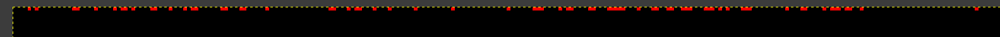

# TrojanCTF 2026 - Misc - Community
Writeup by Anis Errais

### The challenge
We get two images, and the following task:
> We compared their images to the original pictures from the tv show and they seem to be slightly different. Can you figure out what they are trying to hide?

### The solution
The first thing to check is whether there are any differences in the images. This can be seen in GIMP by opening the intercepted image, adding the original as a layer, and setting the blend mode of the original image to Subtract. This reveals a clear difference:

(Note: the image above has been brightened to make the differences more visible)

There are red dots, suggesting that some data is encoded in the difference between the red channels. We can extract the raw data from both images:
```sh
❯ convert original.png -depth 8 rgb:original_red.raw
❯ convert intercepted.png -depth 8 rgb:intercepted_red.raw
```
Then, we can XOR the raw data to get the hidden message:
```sh
❯ perl -e '
open A, "<:raw", shift;
open B, "<:raw", shift;
while (read(A, $a, 4096) && read(B, $b, length($a))) {
    print $a ^ $b;
}
' original_red.raw intercepted_red.raw > output.bin
```
This gives us a binary file with the hidden message. However, the message is not yet in plain text: it is encoded in the red channel still. We can use `xxd` to extract the hex values from the binary file, then use `awk` to extract every third byte (since the red channel is every third byte in the RGB format):
```sh
❯ xxd -p -c1 output.bin | awk 'NR % 3 == 1'
00
00
01
00
01
...
```
We can extend our command to convert this into a bitstring by cutting the first character, removing newlines, and recombining it into 8 bits per line:
```sh
❯ xxd -p -c1 output.bin | awk 'NR % 3 == 1' | cut -c2 | tr -d '\n' | fold -w8
00101010
01001110
11110110
01010110
10000110
...
```
This looks to be ASCII text in LSB-first order. We can convert the bitstrings into ASCII to get the flag:
```sh
❯ xxd -p -c1 output.bin | awk 'NR % 3 == 1' | cut -c2 | tr -d '\n' | fold -w8 | perl -ne 'chomp; print pack("C", oct("0b" . reverse $_))'
Trojan{st3g4n0gr4phy_1s_qu1t3_fun}^@^@^@^@^@^@...
```