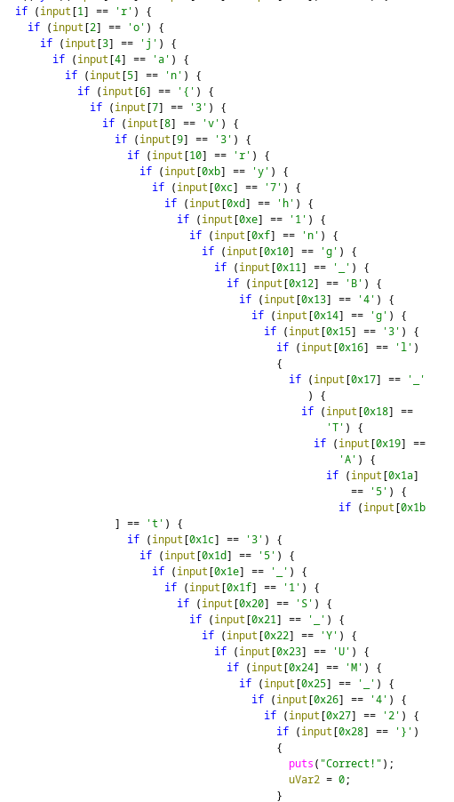

# TrojanCTF  2026 - Rev - Everything Everywhere all at Once
Writeup by Anis Errais

### The challenge
The challenge simply provides a binary, which expects you to enter the correct flag:
```sh
❯ ./everything_everywhere_all_at_once
Enter the flag: thisisobviouslynottheflag
Wrong!
```

### The solution
A first guess would be to simply dump the strings in the binary:
```sh
❯ strings everything_everywhere_all_at_once
...
Trojan{3H
v3ry7h1nH
g_B4g3l_H
TA5t35_1H
5t35_1S_H
YUM_42}
...
```
That's the flag! Or is it...

```sh
❯ ./everything_everywhere_all_at_once
Enter the flag: Trojan{3v3ry7h1ng_B4g3l_TA5t35_15t35_1S_YUM_42}
Wrong!
```

That would be too easy of course. We have to resort to actual reverse-engineering here. 
```asm
001011eb 48 8b 15        MOV        RDX,qword ptr [stdin]
         3e 2e 00 00
001011f2 48 8d 45 90     LEA        RAX=>input+0x1,[RBP + -0x70]
001011f6 be 64 00        MOV        ESI,0x64
         00 00
001011fb 48 89 c7        MOV        RDI,RAX
001011fe e8 5d fe        CALL       <EXTERNAL>::fgets
         ff ff
```
The binary reads the input using `fgets` into a buffer of size 100, offset by 1 byte. Soon after, the input is validated using many steps. First the length is checked to be `0x29`. Then, finding out the first character is easy:
```asm
0010126b 0f b6 45 90     MOVZX      EAX,byte ptr [RBP + input+0x1]
0010126f 3c 54           CMP        AL,0x54
00101271 74 19           JZ         LAB_0010128c
00101273 48 8d 05        LEA        RAX,[s_Wrong!_00102015] ; This loads the "Wrong!" string
         9b 0d 00 00
```
The first input character must be `0x54` or `T`. This matches up with other flags in the CTF, which all start with `Trojan{`. 

Then there follow a bunch of redundant XOR checks. We can completely skip these. Then we finally get to a bunch of these blocks:
```asm
001014d3 0f b6 55 90     MOVZX      EDX,byte ptr [RBP + input[1]]
001014d7 0f b6 45 91     MOVZX      EAX,byte ptr [RBP + input[2]]
001014db 31 d0           XOR        EAX,EDX
001014dd 3c 26           CMP        AL,0x26
```
That's our second character. Since we know the first character is `T`, we can easily determine the second character: `'T' ^ 0x26 = 'r'`.

We can repeat this for all characters, but modern reverse engineering tools make this easy for us. After telling Ghidra that the `input` variable is an array of 100 at RBP-0x78, we can see all the checks at once in the decompilation view:



Our flag from earlier was actually not too far off. It just had a substring of duplicated characters. The correct flag is:
```
Trojan{3v3ry7h1ng_B4g3l_TA5t35_1S_YUM_42}
```
In hindsight, this could have been solved by looking at the encoded flag and noticing that the text had a `15t35` in it, which did not fit the sentence.