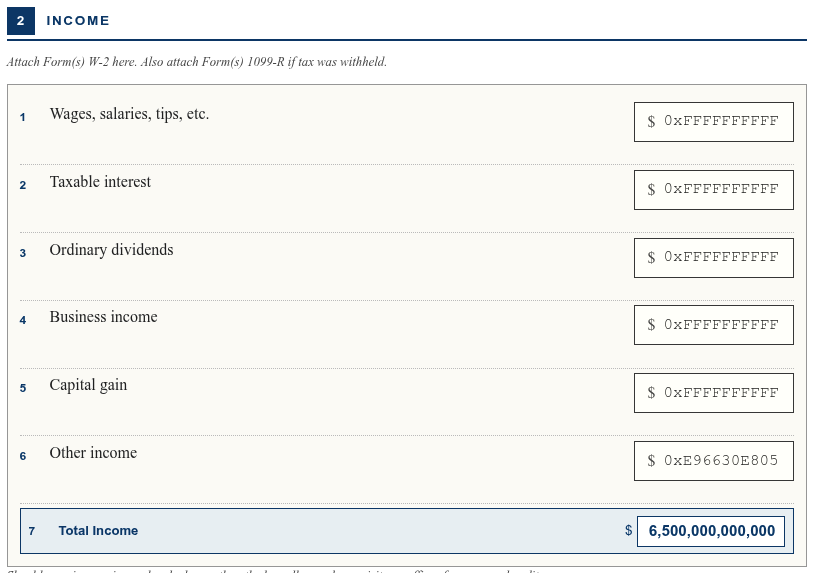
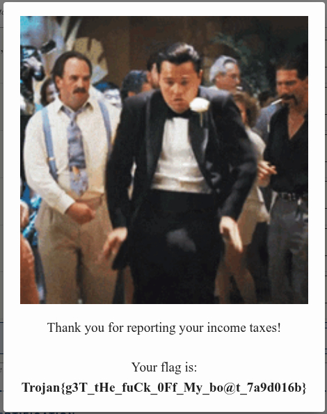

# TrojanCTF 2026 - Web - Sell Me This Exploit
Writeup by Anis Errais

### The challenge
The task is to fill in a IRS application form with 6 fields for various income sources. The total income that needs to be reported is 6.5 trillion US Dollars. However, the maximum input length is 12 characters, so you cannot enter numbers big enough to add up to 6.5 trillion.
The challenge also provides a TypeScript snippet which shows how the fields are verified.

### The solution
The verification function uses the following code to parse the fields:
```typescript
var sum = 0;
for (const field of fields) {
    const value = parseInt(body[field]);
    if (isNaN(value) || value < 0) {
        return [InspectionResult.INVALID_REQUEST, -1];
    }

    sum += value;
}
```
We can exploit the fact that `parseInt` also parses hexadecimal numbers starting with `0x`. While 6.5 trillion does not fit in 6 fields of 12 decimal digits, it does fit in 6 fields of **hexadecimal** digits.

With some trial and error, we can find the following values for the 6 fields:


Submitting the form with these values will give us the flag:


```Trojan{g3T_tHe_fuCk_0Ff_My_bo@t_7a9d016b}```