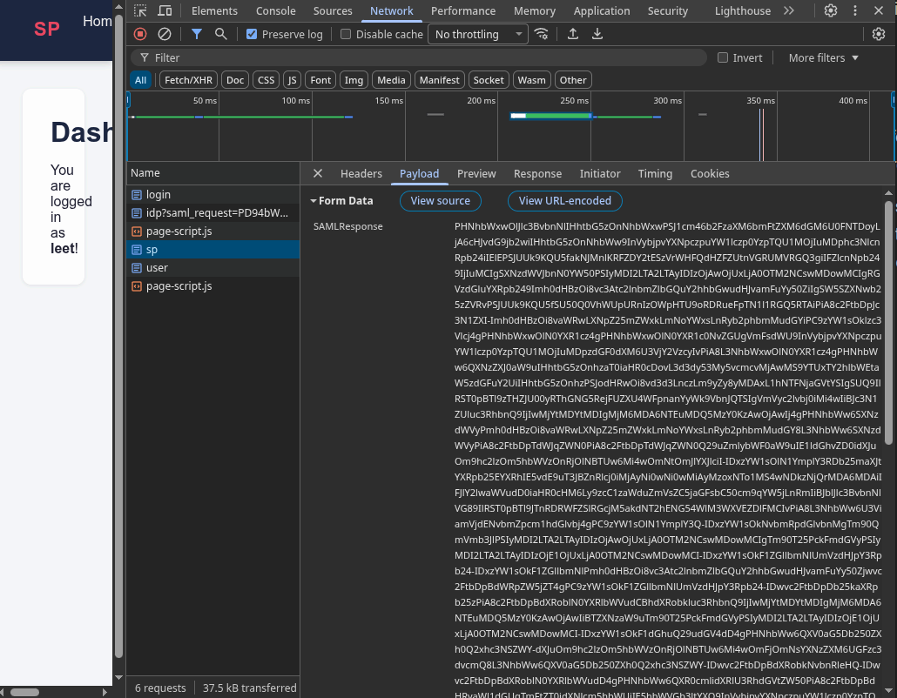
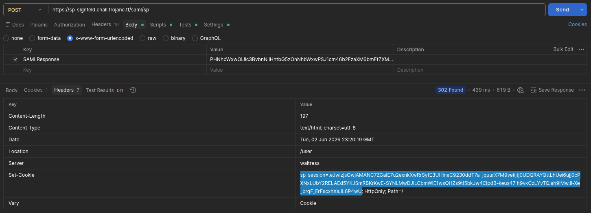
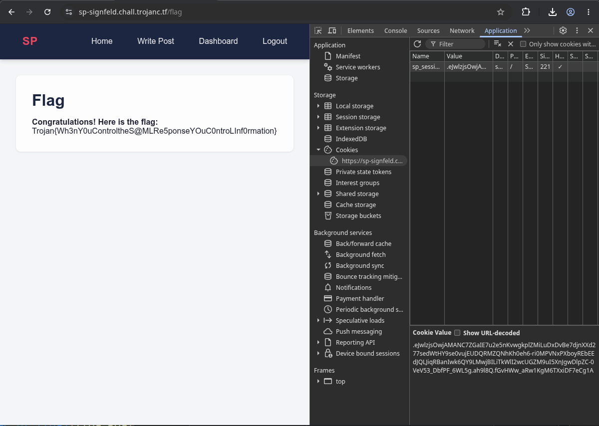

# TrojanCTF 2026 - Web - Signfield
Writeup by Anis Errais

### The challenge
Note: This challenge is identical to the demonstration given during the lecture before the CTF. The only difference is that the demonstration used HTTP, and this challenge uses HTTPS.

The challenge provides two endpoints: an Identity Provider (IDP) and Service Provider (SP). The goal is to log in as admin on the SP website. The challenge is white-box, full source code for both the IDP and SP is available.

### The solution
The two endpoints use a weak form of SAML to communicate. The SP in particular does not verify the SAML response from the IDP properly. The important part of the SAML response does have to be properly signed by the IDP, but when extracting the username, it does not check whether it extracts it from the signed part of the document. Instead it just picks out the *first* SAML assertion block, and extracts the username from there:

```python
username = html.unescape(response_xml.find(".//{urn:oasis:names:tc:SAML:2.0:assertion}AttributeValue").text)
```

We can exploit this by adding a second `<saml:Assertion>` block to the SAML response, which does not have to be signed. We can put the username "admin" in this block, to trick the SP into logging us in as admin.

We can start by opening a browser, opening the Network in tab developer tools and logging into the SP. This will forward you to the IDP to perform the authentication. After logging in, your browser will receive a signed SAML Response from the IDP and it will forward it to the SP. We track this using the browser, so that we do not have to set up any complicated HTTPS interception with tools like Burp and Wireshark.

Since we tracked all network activity, we can look at it in the developer tools:


The `sp` request is the most interesting, that contains the SAML response forwarded to the SP. The SAML Response is encoded with Base64URL, so we can decode it to get the XML content. 

In the XML content, we can insert our malicious `<saml:Assertion>` block with the username "admin". 
```xml
...
<saml:Assertion
        xmlns:xsi="http://www.w3.org/2001/XMLSchema-instance"
        xmlns:xs="http://www.w3.org/2001/XMLSchema" ID="INJECTED">
    <saml:AttributeStatement>
        <saml:Attribute Name="username" NameFormat="urn:oasis:names:tc:SAML:2.0:attrname-format:basic">
            <saml:AttributeValue xsi:type="xs:string">admin</saml:AttributeValue>
        </saml:Attribute>
    </saml:AttributeStatement>
</saml:Assertion>
<!-- original saml:Assertion block here -->
<saml:Assertion
        xmlns:xsi="http://www.w3.org/2001/XMLSchema-instance"
        ...
```
We can then encode the modified XML back to Base64URL. Note that you cannot touch the original `<saml:Assertion>` block at all, and that your inserted XML may not contain any whitespace between tags. Finally, you can forward it to the SP. This will give you a session cookie for the admin user, which can be used to get the flag. 

We used Postman to do this, but there are a variety of other ways you can send this request (eg. Firefox can do replay, which immediately puts the cookie in your browser):


In any case, you can modify your cookies in the developer tools to get the flag:



```Trojan{Wh3nY0uControltheS@MLRe5ponseYOuC0ntroLInf0rmation}```


